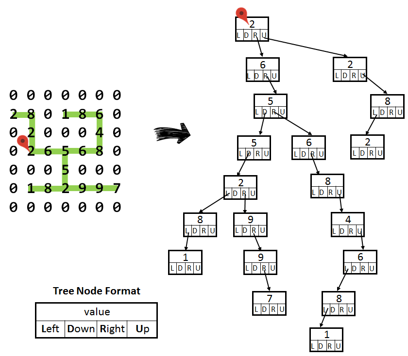
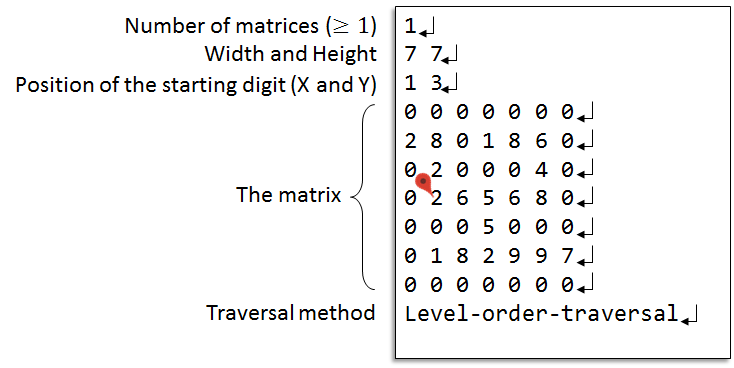
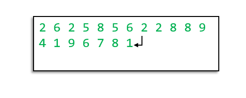

# [Matrix to Tree Converter](https://acm.cs.nthu.edu.tw/problem/11902/)
## Description
- Given
  - A matrix of digits
  - A starting non-zero digit
  - A traversal method
- Task
  - Convert the nonzero digits of the path in matrix into a tree
  - Print out the digits according to one of the following tree traversal methods
    - Level-order-traversal
    - Pre-order-traversal
    - Post-order-traversal
- Example

## Input


width < 100 and height <100 

Traversal method can be one of the following:

* "Level-order-traversal"
* "Pre-order-traversal"
* "Post-order-traversal"
## Output


print out the tree traversal
##
### Sample Input
```
6
7 7
1 3
0 0 0 0 0 0 0
2 8 0 1 8 6 0
0 2 0 0 0 4 0
0 2 6 5 6 8 0
0 0 0 5 0 0 0
0 1 8 2 9 9 7
0 0 0 0 0 0 0
Level-order-traversal
7 7
1 3
0 0 0 0 0 0 0
2 8 0 1 8 6 0
0 2 0 0 0 4 0
0 2 6 5 6 8 0
0 0 0 5 0 0 0
0 1 8 2 9 9 7
0 0 0 0 0 0 0
Pre-order-traversal
7 7
1 3
0 0 0 0 0 0 0
2 8 0 1 8 6 0
0 2 0 0 0 4 0
0 2 6 5 6 8 0
0 0 0 5 0 0 0
0 1 8 2 9 9 7
0 0 0 0 0 0 0
Post-order-traversal
7 6
3 3
0 0 0 6 3 0 0
1 0 6 4 0 5 1
2 5 0 2 0 8 0
0 9 7 9 3 4 0
0 0 0 1 0 0 0
0 0 1 6 5 1 7
Pre-order-traversal
7 6
3 3
0 0 0 6 3 0 0
1 0 6 4 0 5 1
2 5 0 2 0 8 0
0 9 7 9 3 4 0
0 0 0 1 0 0 0
0 0 1 6 5 1 7
Post-order-traversal
7 6
3 3
0 0 0 6 3 0 0
1 0 6 4 0 5 1
2 5 0 2 0 8 0
0 9 7 9 3 4 0
0 0 0 1 0 0 0
0 0 1 6 5 1 7
Level-order-traversal
```
### Sample Output
```
2 6 2 5 8 5 6 2 2 8 8 9 4 1 9 6 7 8 1
2 6 5 5 2 8 1 9 9 7 6 8 4 6 8 1 2 8 2
1 8 7 9 9 2 5 1 8 6 4 8 6 5 6 2 8 2 2
9 7 9 5 2 1 1 6 1 5 1 7 3 4 8 5 1 2 4 6 6 3
1 2 5 9 7 1 7 1 5 6 1 1 5 8 4 3 6 3 6 4 2 9
9 7 1 3 2 9 6 4 4 5 1 5 8 6 6 2 1 5 3 1 7 1
```
